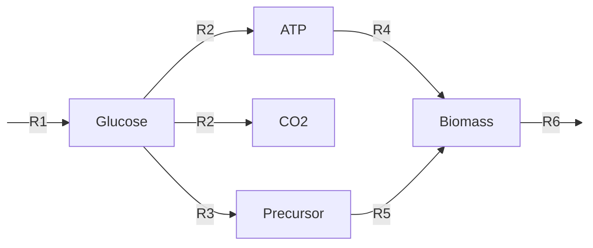

# Mathematical Framework of FBA

The mathematical framework of FBA is integral to its function and effectiveness in systems biology. Here, we delve into how FBA models are built and the key concepts underpinning these models.

## Building the FBA Model: Basics of the Stoichiometric Matrix

As already hinted in the [principles](./principles.md) of FBA, one model typically consists of a large number of stoichiometric equations.
Those equations can be derived from a [metabolic network](./introduction.md#what-is-flux-balance-analysis). We will now construct the mathematical construct ourselves with this tiny model as an example:

If we follow along this tiny metabolic network, we see that one Glucose is produced by $R1$ and is consumed by $R2$ and $R3$, therefore we would get:
$ R1 - R2 - R3 = 0 $.
:::info
Note, that $ R1 - R2 - R3 = 0 $ is equal to $ 1*R1 - 1*R2 - 1*R3 = 0 $.
:::

Now, if we write the other reactions out of the model we get a set of equations like this:
$$
\begin{align*}
R1 - R2 - R3 &= 0 \quad &\text{(Glucose)} \\
R2 &= 0 \quad &\text{(CO2)} \\
R2 - R4 &= 0 \quad &\text{(ATP)} \\
R3 - R5 &= 0 \quad &\text{(Precursor)} \\
(R4 + R5) - R6 &= 0 \quad &\text{(Biomass)}
\end{align*}
$$
With those equations, we can build the core component of every FBA model: The stoichiometric matrix $ S $. 
It is defined as a two-dimensional matrix where rows represent different metabolites and columns represent reactions:
$$
S = \begin{bmatrix}
    s_{11} & s_{12} & \cdots & s_{1n} \\
    s_{21} & s_{22} & \cdots & s_{2n} \\
    \vdots & \vdots & \ddots & \vdots \\
    s_{m1} & s_{m2} & \cdots & s_{mn}
\end{bmatrix}
$$

Each element, $ s_{ij} $, indicates the involvement of metabolite $ i $ in reaction $ j $.

For our simple metabolic model the stoichiometric matrix can be represented as:

$$
\begin{array}{c|cccccc}
& \text{R1} & \text{R2} & \text{R3} & \text{R4} & \text{R5} & \text{R6} \\
\hline
\text{Glucose} & 1 & -1 & -1 & 0 & 0 & 0 \\
\text{CO2} & 0 & 1 & 0 & 0 & 0 & 0 \\
\text{ATP} & 0 & 1 & 0 & -1 & 0 & 0 \\
\text{Precursor} & 0 & 0 & 1 & 0 & -1 & 0 \\
\text{Biomass} & 0 & 0 & 0 & 1 & 1 & -1 \\
\end{array}
$$

- Negative values indicate the consumption of a metabolite in a reaction.
- Positive values indicate the production of a metabolite.
- The value itself indicates the count of the metabolite (e.g. one Glucose to two Precursor)

## Introduction to Linear Programming in FBA

Flux Balance Analysis (FBA) employs linear programming, a mathematical method for finding the maximum or minimum value of a linear function, to determine the flow of metabolites through a metabolic network. This optimization is crucial for predicting the most efficient pathways that a cell might use under certain conditions.

The objective function in FBA, which we seek to optimize, typically represents a biological goal such as maximizing growth rate or metabolite production. It is formulated as follows:

$$
\text{Maximize} \: Z = c^T \cdot v
$$

Here, $ c $ is a vector containing coefficients that define the contribution of each reaction to the objective function, and $ v $ represents the flux vector, containing the rates of each reaction within the metabolic network.

For example, if the goal is to maximize the production of Biomass, the objective function may look like this:
$$
\text{Maximize} \: Z = [0 \quad 0 \quad 0 \quad 0 \quad 0 \quad 1] \cdot \begin{bmatrix}
    v_1 \\
    v_2 \\
    v_3 \\
    v_4 \\
    v_5 \\
    v_6 \\
\end{bmatrix}
$$

In this case, $ v_6 $ represents the flux through the reaction producing Biomass ($R6$), and the coefficient corresponding to $ v_6 $ in the vector $ c $ is 1, emphasizing its importance in the optimization process. This specific example would mean that only reaction $R6$ is contributing to the objective function with the flux provided in the flux vector. As it is the only reaction contributing to the objective function the optimal solution or the maximum would be the upper limit of the flux of $ v_6 $.

## Key Constraints: Mass Balance and Capacity

- **Mass Balance Constraint**: Ensures that for each metabolite, the rate of its production equals the rate of its consumption.
  
  $$
  S \cdot v = 0
  $$

- **Capacity Constraints**: These include limits on the flux of reactions, ensuring realistic biological conditions.

  $$
  v_{\text{min}} \leq v \leq v_{\text{max}}
  $$

Understanding these mathematical principles is vital for effectively utilizing FBA in metabolic network analysis and optimization.

