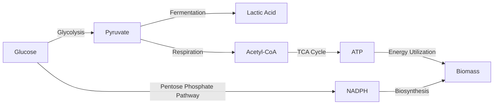

# Introduction to Flux Balance Analysis

Flux Balance Analysis (FBA) is a computational approach that has revolutionized
our understanding of metabolic networks in various organisms, particularly in
microorganisms like bacteria and yeast. In this introduction, we will explore
the basics of FBA and its importance in the field of systems biology.

## What is Flux Balance Analysis?

FBA is a method used to analyze the flow of metabolites through a metabolic
network. This network consists of biochemical reactions within a cell, which are
essential for it to grow and function. FBA uses mathematical models to predict
how these reactions occur and to what extent, based on the limitations and needs
of the cell.

A simplified example of a metabolic network, illustrating the pathways and key
metabolites involved in glucose metabolism.

## Why FBA?

The primary purpose of FBA is to provide insights into cellular metabolism
without the need for detailed kinetic data, which is often difficult to obtain.
FBA allows researchers to predict the growth rate of an organism, the production
rate of a particular metabolite, and the effects of genetic modifications. It
serves as a critical tool in metabolic engineering, aiding in the design of more
efficient microbial strains for industrial applications like biofuel production
and pharmaceutical synthesis.

In summary, FBA offers a window into the complex world of cellular metabolism,
enabling us to understand and manipulate these systems for various applications.
Its development marked a significant advancement in systems biology, providing a
framework to address questions that were previously out of reach.

In the following sections, we will delve deeper into the principles,
mathematical framework, objectives, and applications of FBA, laying a foundation
for understanding this fascinating and influential field.
