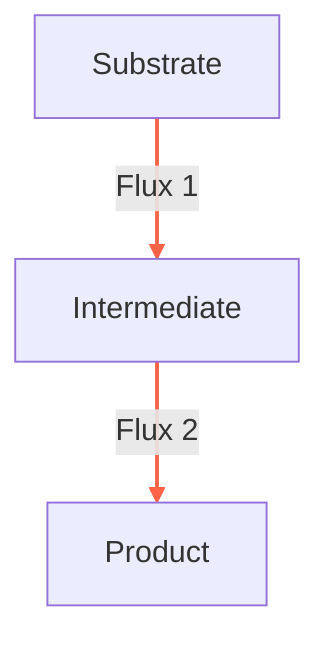

# Principles of FBA

FBA is built on foundational principles that enable it to model metabolic networks effectively. Understanding these principles is key to applying FBA in various biological contexts.

## Basic Concepts and Key Terms

FBA revolves around a few critical concepts:

- **Metabolic Network**: A network representing all the metabolic reactions occurring in a cell.
- **Flux**: The rate at which metabolites are processed in a reaction.
- **Steady-State Assumption**: The principle that, in a metabolic network, the concentrations of intermediate metabolites remain constant over time.

This diagram represents a simple metabolic network with a substrate, an intermediate, and a product. The arrows labeled "Flux 1" and "Flux 2" demonstrate the flow of metabolites, illustrating the concept of flux in FBA. The steady-state assumption in FBA is implied by the continuous and balanced flow from the substrate through the intermediate to the product, indicating that the concentration of the intermediate remains constant over time.

## Understanding the Role of Stoichiometry

Stoichiometry in FBA refers to the quantitative relationships between reactants and products in metabolic reactions. It is critical in determining the flow of metabolites through the network.

Here are some examples of stoichiometric equations:
- $\text{Glucose} + 2\, \text{NAD}^+ \rightarrow 2\, \text{Pyruvate} + 2\, \text{NADH}$
- $6\, \text{CO}_2 + 6\, \text{H}_2\text{O} \rightarrow \text{C}_6\text{H}_{12}\text{O}_6 + 6\, \text{O}_2$
- $\text{C}_6\text{H}_{12}\text{O}_6 \rightarrow 3\, \text{CO}_2 + 3\, \text{CH}_3\text{CH}_2\text{OH}$

It is not different from the equations one were taught in school, with the difference that stoichiometric equations are balanced in mass. You will see that the same mass is going in as an reactant and coming out as a product.